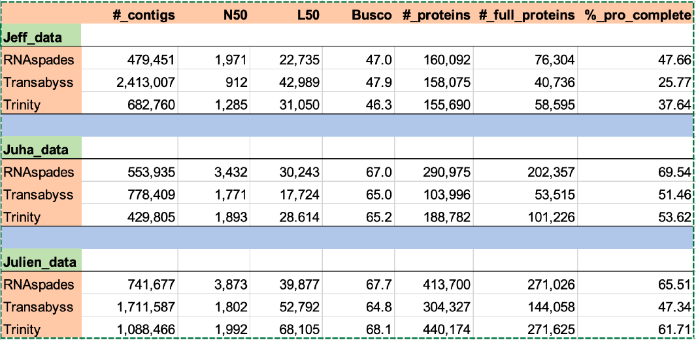

# ReindeerTranscriptome

### Principal Investigator: Jeff Biernaskie
### Institution: Faculty of Veterinary Medicine, University of Calgary

## Description of Project

In adult mammals, deep skin injuries heal by rapid repopulation with reactive fibroblasts that deposit extracellular matrix and form fibrotic scar tissue. Discovery of a tight-skinned, free-living mammal that exhibits both skin regeneration and fibrotic repair would enable comparative insights that better contextualizes human healing. In reindeer (Rangifer tarandus), antlers are regenerated annually in both sexes and grow at an explosive rate exceeding 1 cm in length each day. Growing antlers are covered by specialized skin called velvet. Therefore, antler velvet itself may harbor innate regenerative capacity and could represent a unique model to study the molecular events enabling adult skin regeneration.

Despite considerable endeavors, a well annotated genome and transcriptome are still missing for the reindeer. In collaboration with Drs. Claude Robert and Julien Prunier (University of Laval) and Dr. Juha Kantanen (Natural Resources Institute of Findland), we initiated an effort to assembly the reindeer transcriptome. Here we describe the bioinformatics procedures undertaken.

## Bioinformatics

### Description of datasets

The main directory of the project in ARC is:
'/work/vetmed_data/jj/projects/jeffBiernaski/reindeer/transcriptome_assembly/'

1. Jeff Biernaskie data: 35 single-end (150 bp) RNAseq libraries from antlers and back tissue, described in (https://pubmed.ncbi.nlm.nih.gov/36493752/).
2. Julien Prunier data: 1 paired-end (150 bp) RNAseq libraries from organ tissues.
3. Juha Kantanen data: 46 paired-end (75 bp) RNAseq libraries from 3 adipose tissues of a male.

### Preliminary assemblies

Three well-reputated assembly software were tested to assemble each of the transcriptomes:

#### Trinity
Model: The Bruijn graph-based
Desirable features: Downstream processing and annotation tools
Developers: Team of Aviv Regev and Brian Hass (MIT)
Reference: Nat. Protoc. 8, 1494-1512. (2013)

#### RNAspades
Model: The Bruijn graph and graph-based 
Desirable features: Very successful assemblers for genome and metagenome assembly
Developers: Team of Andrey D Prjibelski (Center for Algorithmic Biotechnology)
Reference: Gigascience 8:9, giz100 (2019)

#### Transabyss
Model: The Bruijn graph and graph-based
Desirable features: Laval group had good experience with it. 
Developers: Team of Inanc Birol (BC Cancer Research Institute)
(Inanc Birol) Nat. Methods 7, 909-912. (2010).

Assemblies were conducted separately, for each data set, and are stored in the following subdirectories:

jeffData
juhaData
julienData

Here a summary of assembly results:

  

Data in ARC:

'/work/vetmed_data/jj/projects/jeffBiernaski/reindeer/transcriptome_assembly/all_sequences_together/60Gb_Rt_all_trinity_single_assembly'

