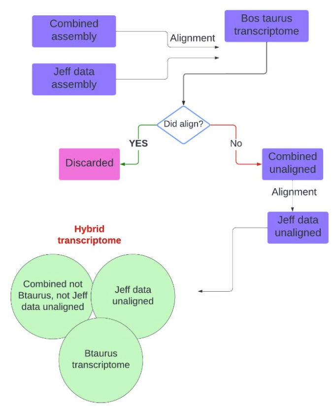

# Using the hybrid transcriptome
 

## Introduction
  Initially, a series of transcriptomes assemblies were conducted as described [here](../README.md). In a nutshell, several transcriptome assemblies were conducted using three datasets. One of those assemblies was conducting using data from bulk RNAseq libraries from skin and antlers of reindeer, as described in [Sinna et al., 2022](https://pubmed.ncbi.nlm.nih.gov/36493752/). Because the main goal of assembling this hybrid (*Rangifer tarandus* & *Bos taurus*) was to improve on the *B. taurus* transcriptome being used as reference for RNAseq studies in *R. tarandus*, we gave 'preference' to those transcripts assembled from *R. tarandus* data. Below as schematics of the assembly process.

  

    